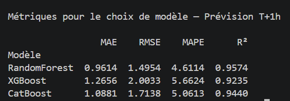

RandomForest est le meilleur sur tous les critères :

- R² = 0.957 -> le modèle explique 95.7% de la variance de la température, largement au-dessus du seuil MSPR (0.5)
- MAE = 0.96°C -> en moyenne il se trompe de moins de 1°C, c'est excellent pour une prévision horaire
- MAPE = 4.6% -> erreur relative de seulement 4.6%